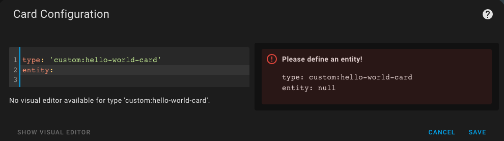
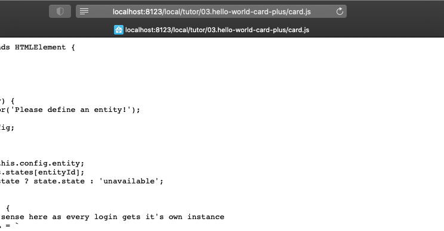
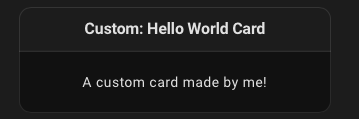

# Hello World Card Plus

Some steps beyond

***

* @published: January 2023
* @author: Elmar Hinz
* @workspace: `conf/www/tutor`

You learn:

* how to assist the setup with error messages
* how to provide a default configuration for the card
* how to add the card to the visual selection

## Prerequisites

* tutorial 02: Hello world card

## Setup

Take the same steps as for the previous tutorial. Mind to update the
path of the resource of the `hello-world-card` to match this repository.

## The Code

Find the code in the file named `card.js` alongside with this README.

### Assisting the setup

While setting up your card in the dashboard, `setConfig()` gets triggered upon
edit with the configuration data.

```js
setConfig(config) {
    if (!config.entity) {
        throw new Error('Please define an entity!');
    }
    this.config = config;
}
```

You consume it to set up the internal
configuration of the object. Our card requires an entity. If it is missing, the
method throws an error.



The error will be caught to be displayed in an error frame to guide the user.

### Providing a default configuration

To provide a default configuration define a method `getStubConfig`. It must
return a data object (json) holding the properties you want to set a default for
(without the `type:` parameter).

```js
static getStubConfig() {
    return { entity: "sun.sun" }
}
```



If you change the code in `card.js` for testing, you may have difficulties to
reload it. In this case it may help, to directly reload the script and check,
that it has been updated.

### Adding the card to rhe visual card selection

To register your card for the visual selection register it the the
`window.customCards` list. Add an object with the keys `type` and `name` and
optionally `description`.

```js
window.customCards = window.customCards || [];
window.customCards.push({
    type: "hello-world-card",
    name: "Hello World Card",
    description: "A custom card made by me!" // optional
});
```

The type has to match the name of the custom element you did set. Remember?

```js
customElements.define('hello-world-card', HelloWorldCard);
```



#### A note aside

If you are a little experienced, you will wounder, that there is no interface to
register the card and that the internal implementation of the registry gets
exposed. You even have to care to create the list, if it does not already exist.

That's a decision made by the developers. A likely reason is, that all
dependencies shall be avoided to give you the full freedom to choose your own
tools. You may consider to pack the lines after the body of the class into a
function with suitable parameters, that you can reuse for all your cards.

### Summary

Let's wrap up the ***Hello World*** tutorials. There are two main points to
mention on the level of architecture.

First, the card is a [***custom
element***](https://developer.mozilla.org/en-US/docs/Web/Web_Components/Using_custom_elements).
The class inherits  a lot of methods from `HTMLElement` or any equivalent parent
class. Often you will find cards, that inherit from [`LitElement`](https://lit.dev).

Second, there is an interface to the ***Home Assistant Frontend***. Some methods
are required, others are optional. There is no full specification yet. In doubt
the source is the authority.

You did learn, how to throw errors to help the user with the setup of the card.
In addition you can provide a default configuration. Finally you did learn, how
to register the card for the visual card selection.
